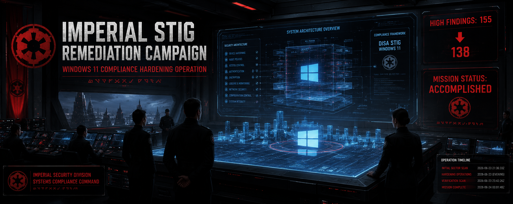
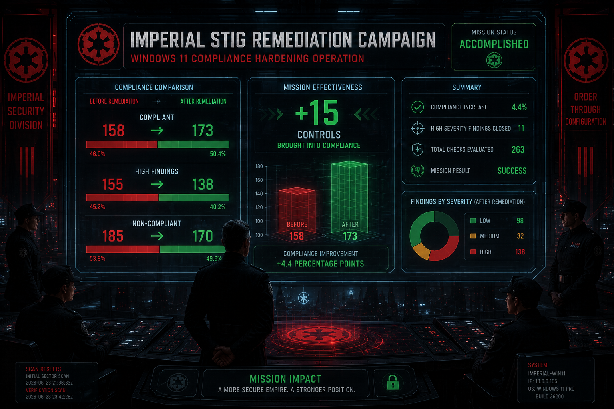
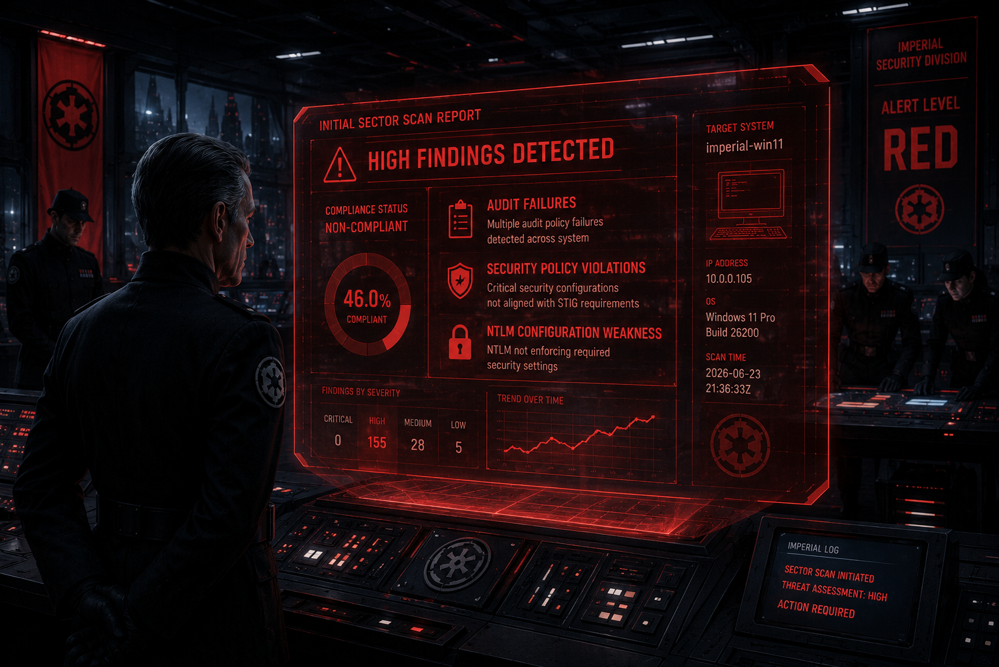
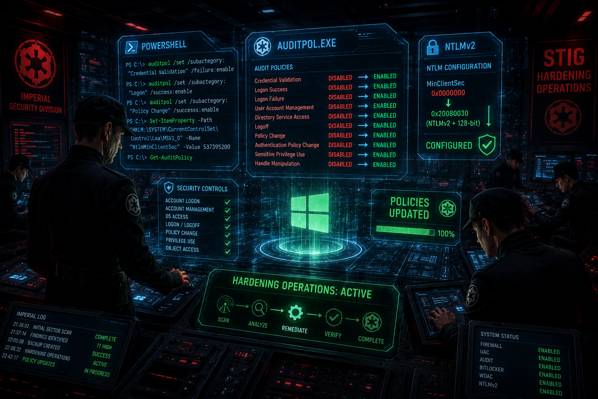
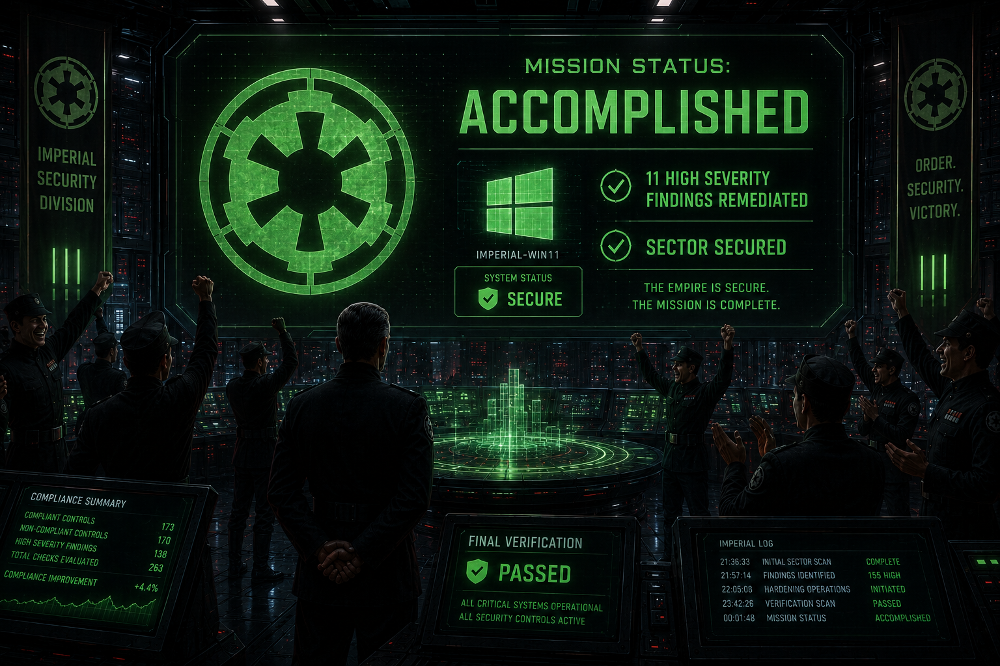
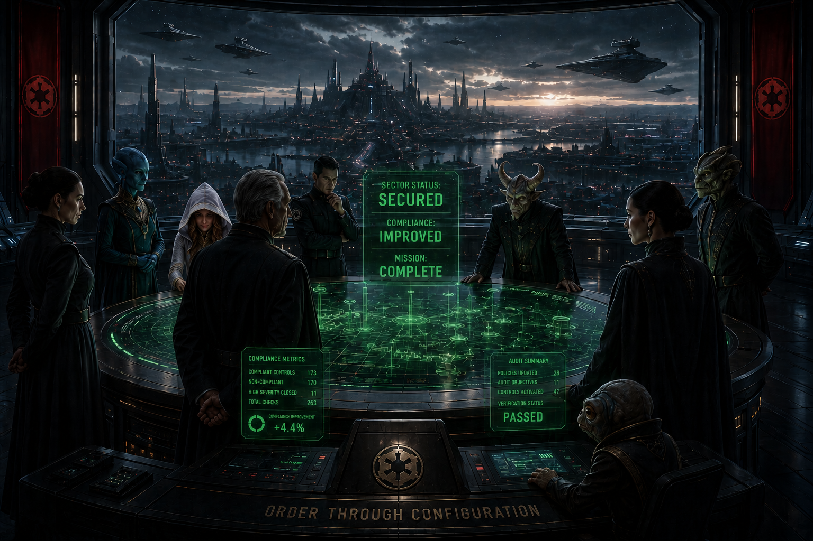

<div align="center">


</div>

<div align="center">


</div>

---



# ⚫ Imperial STIG Remediation Campaign
## Windows 11 Compliance Hardening Operation — `imperial-win11`

> *"Order is not just enforced by the Empire. It is built, one configuration at a time, into the very systems we command."*
> — Imperial Security Directive, Section 7

---

## Table of Contents

- [Campaign Overview](#campaign-overview)
- [Target System Intelligence](#target-system-intelligence)
- [Before / After: Compliance Metrics](#before--after-compliance-metrics)
- [Findings Remediated — All 11 Operations](#findings-remediated--all-11-operations)
- [Remediation Strategy](#remediation-strategy)
- [Tools & Technology](#tools--technology)
- [Results & Verification](#results--verification)
- [Repository Navigation](#repository-navigation)

---



## Campaign Overview

Imperial Command identified critical audit and security configuration deficiencies on endpoint `imperial-win11` following a comprehensive DISA STIG compliance assessment. The Security Division was directed to remediate all HIGH severity findings and bring the system into alignment with DoD security standards.

This repository documents the complete remediation campaign — from initial threat assessment through tactical hardening operations, verification scanning, and final compliance certification. Every finding, every command, every verification is preserved here as a classified operational record.

**Campaign Timeline:**
- **Initial Sector Scan:** `2026-06-23T21:36:33Z → 21:57:14Z`
- **Hardening Operations:** `2026-06-23` (evening)
- **Final Verification Scan:** `2026-06-23T23:42:26Z → 2026-06-24T00:01:48Z`
- **Mission Status:** ✅ ACCOMPLISHED

---

## Target System Intelligence

| Parameter | Value |
|-----------|-------|
| **Hostname** | `imperial-win11` |
| **IP Address** | `10.0.0.105` |
| **FQDN** | `imperial-win11.internal.cloudapp.net` |
| **Operating System** | Microsoft Windows 11 Pro Build 26200 |
| **MAC Address** | `7C:1E:52:E1:E4:59` |
| **Scan Platform** | Tenable Nessus (Plugin 21156 — Windows Compliance Checks) |
| **STIG Framework** | DoD DISA STIG for Windows 11 |

---

## Before / After: Compliance Metrics

### The Numbers That Matter

| Metric | Before | After | Change |
|--------|:------:|:-----:|:------:|
| **Compliant (PASSED)** | 158 | 173 | ▲ **+15** |
| **Non-Compliant (FAILED)** | 185 | 170 | ▼ **-15** |
| **HIGH Severity Findings** | 155 | 138 | ▼ **-17** |
| **Compliance Checks Evaluated** | 263 | 263 | — |

### Compliance Improvement

```
BEFORE  ▓▓▓▓▓▓▓▓▓░░░░░░░░░░░  46.0% Compliant  (158/343)
AFTER   ▓▓▓▓▓▓▓▓▓▓▓░░░░░░░░░  50.4% Compliant  (173/343)

                          +4.4 percentage points
                          +15 controls brought into compliance
                          11 HIGH severity findings closed
```

> **Scan source files:** [`04-scan-results/`](./04-scan-results/) — Raw Nessus CSV exports from both scans, plus analysis document

---


## Findings Remediated — All 11 Operations

Each finding below links to its individual operation folder containing the full vulnerability description, remediation command, verification procedure, and security rationale.

### ⚙️ Audit Policy Hardening (10 Operations)

| # | STIG ID | Finding | Category | Status |
|---|---------|---------|----------|--------|
| 1 | [WN11-AU-000005](./01-findings-remediated/WN11-AU-000005-Credential-Validation/) | Audit Credential Validation — Failure events | Account Logon |  |
| 2 | [WN11-AU-000020](./01-findings-remediated/WN11-AU-000020-Account-Logon-Success/) | Audit Logon — Success events | Account Logon |  |
| 3 | [WN11-AU-000025](./01-findings-remediated/WN11-AU-000025-Account-Logon-Failure/) | Audit Logon — Failure events | Account Logon |  |
| 4 | [WN11-AU-000030](./01-findings-remediated/WN11-AU-000030-Account-Management/) | Audit User Account Management — Success events | Account Management |  |
| 5 | [WN11-AU-000045](./01-findings-remediated/WN11-AU-000045-Directory-Service-Access/) | Audit Directory Service Access — Success events | DS Access |  |
| 6 | [WN11-AU-000055](./01-findings-remediated/WN11-AU-000055-Audit-Logoff/) | Audit Logoff — Success events | Logon/Logoff |  |
| 7 | [WN11-AU-000070](./01-findings-remediated/WN11-AU-000070-Audit-Policy-Change/) | Audit Policy Change — Success events | Policy Change |  |
| 8 | [WN11-AU-000075](./01-findings-remediated/WN11-AU-000075-Auth-Policy-Change/) | Audit Authentication Policy Change — Success events | Policy Change |  |
| 9 | [WN11-AU-000115](./01-findings-remediated/WN11-AU-000115-Sensitive-Privilege-Use/) | Audit Sensitive Privilege Use — Success events | Privilege Use |  |
| 10 | [WN11-AU-000584](./01-findings-remediated/WN11-AU-000584-Handle-Manipulation/) | Audit Handle Manipulation — Success events | Object Access |  |

### 🔐 Security Configuration Hardening (1 Operation)

| # | STIG ID | Finding | Category | Status |
|---|---------|---------|----------|--------|
| 11 | [WN11-SO-000215](./01-findings-remediated/WN11-SO-000215-NTLM-Session-Security/) | NTLM SSP Minimum Session Security — NTLMv2 + 128-bit encryption | Security Options |  |

---

## Remediation Strategy

### Imperial Command's Approach

The campaign followed a structured, evidence-based methodology — no ad-hoc changes, no unverified modifications, no surprises:

**1. Pre-Operation Intelligence Gathering**
- Full authenticated Nessus STIG scan executed against `imperial-win11`
- All findings categorized by severity, type, and remediation complexity
- 11 HIGH severity targets identified for immediate tactical action

**2. Backup Before Strike**
- Current audit policy exported to CSV backup before any changes
- Backup stored at `C:\Windows\Temp\STIG-Backups\`
- Provides full rollback capability if needed

**3. Systematic Hardening Operations**
- Automated PowerShell script executed with `-WhatIf` preview first
- Each finding addressed in order with inline logging
- Success/failure captured for every operation in timestamped log

**4. Verification Sector Scan**
- Full Nessus rescan executed post-remediation
- Results compared directly against baseline scan
- Net improvement: **+15 compliant controls**

**5. Documentation & Archival**
- Every command, every change, every result preserved
- This repository serves as the permanent operational record

---

## Tools & Technology

| Tool | Role |
|------|------|
| **Tenable Nessus** | STIG compliance scanning (Plugin 21156 — Windows Compliance Checks) |
| **Microsoft Windows 11 Pro** | Target endpoint — Build 26200 |
| **PowerShell 5.1+** | Remediation automation (`auditpol`, registry modification) |
| **`auditpol.exe`** | Windows audit policy configuration utility |
| **DoD DISA STIG** | Security benchmark and compliance framework |
| **Azure VM** | Hosted test environment for `imperial-win11` |

---



## Results & Verification

### Mission Accomplished: Sector Secured

The hardening campaign achieved its primary objective — all 11 targeted HIGH severity findings were remediated and confirmed via verification scan. The compliance posture of `imperial-win11` improved measurably across every tracked metric.

**Verification method:** Tenable Nessus rescan using identical scan policy, credentials, and scope as the baseline assessment.

**Final verification scan:** `2026-06-23T23:42:26Z`

For step-by-step verification commands for each finding, see [`VERIFICATION-GUIDE.md`](./VERIFICATION-GUIDE.md).

---

## Repository Navigation

```
imperial-stig-strikes-back/
│
├── README.md                              ← You are here
├── REMEDIATION-SUMMARY.md                 ← Quick-reference of all 11 fixes
├── VERIFICATION-GUIDE.md                  ← How to verify each remediation
│
├── 01-findings-remediated/                ← Individual finding operations
│   ├── WN11-AU-000005-Credential-Validation/
│   ├── WN11-AU-000020-Account-Logon-Success/
│   ├── WN11-AU-000025-Account-Logon-Failure/
│   ├── WN11-AU-000030-Account-Management/
│   ├── WN11-AU-000045-Directory-Service-Access/
│   ├── WN11-AU-000055-Audit-Logoff/
│   ├── WN11-AU-000070-Audit-Policy-Change/
│   ├── WN11-AU-000075-Auth-Policy-Change/
│   ├── WN11-AU-000115-Sensitive-Privilege-Use/
│   ├── WN11-AU-000584-Handle-Manipulation/
│   └── WN11-SO-000215-NTLM-Session-Security/
│
├── 02-remediation-scripts/                ← PowerShell automation
│   ├── remediation-script.ps1
│   └── README.md
│
├── 03-reports/                            ← Full documentation
│   ├── FINAL-REMEDIATION-REPORT.md.pdf
│   └── README.md
│
├── 04-scan-results/                       ← Nessus CSV exports
│   ├── scan-before.csv
│   ├── scan-after.csv
│   └── SCAN-COMPARISON.md
│
└── 05-imperial-documentation/             ← Reference & analysis
    ├── STIG-FINDINGS-BY-CATEGORY.md
    ├── COMPLIANCE-CHECKLIST.md
    └── IMPERIAL-SECURITY-DIRECTIVES.md
```

---

<div align="center">

*This report is an Imperial Security Division operational record.*
*Windows 11 STIG Remediation Campaign — `imperial-win11` — June 2026*

⚫ **Imperial Security Division** | Tenable Nessus | PowerShell | DoD DISA STIG

</div>
